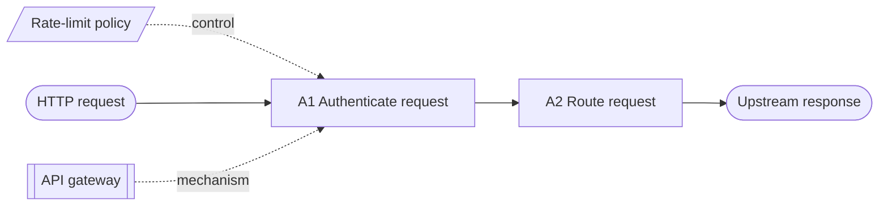

# Diagram standards that pair with STE

For the visual look (line weights, colors, grid, callout style), see
[styles.md](styles.md).

STE controls the words. These standards control the pictures. Each one solved
"make a complex system readable by someone who did not build it" in its own
field. Below: what each standard is, the rules worth taking from it, and how to
apply them to a Mermaid, SVG or HTML diagram.

Status notes are as of 2025. Most of these standards are paid documents. IDEF0
(FIPS 183) is a free US federal publication.

## Which standard for which question

| The reader asks… | Use the conventions of | Diagram type |
|---|---|---|
| "What does this system do, and what controls it?" | **IDEF0** (FIPS 183 / IEEE 1320.1) | Function boxes with ICOM arrows |
| "In what order do things happen? Where does it branch?" | **ISO 5807** flowcharts | Flowchart |
| "What happens in each state, and what moves it to the next?" | **IEC 60848 GRAFCET** / UML state machine | Step–transition chart |
| "How does the signal / data / power flow through the parts?" | **IEC 61082-1** + **IEC 60617** | Block or circuit diagram |
| "Which part is which, where is it, what is it part of?" | **IEC 81346** reference designations | Labels on any diagram |
| "Where is the part on the real thing?" | **S1000D** / ATA iSpec 2200 illustration practice | Callout illustration |
| "What process instruments and loops are there?" | **ANSI/ISA-5.1** | P&ID |
| "What talks to what, at what level of zoom?" | **C4 model** (not a formal standard) / UML / SysML | Context → container → component |
| "Who does which step in a business process?" | **BPMN 2.0** (ISO/IEC 19510) | Swimlane process |
| "What is dangerous here?" | **ISO 3864 / ISO 7010 / ANSI Z535** | Safety signs and colors |
| "What does this indicator color mean?" | **IEC 60073** | Status color coding |

---

## 1. IDEF0 — functional decomposition (FIPS 183)

The best match for "explain what a system does". It forces structure.

Rules to adopt:
- **Box = function. Label = verb phrase** ("Validate order"). **Arrow = thing. Label = noun** ("order", "price table").
- **ICOM sides are fixed:**
  - **I**nput enters from the **left** (what the function changes)
  - **C**ontrol enters from the **top** (what governs it: rules, config, policy)
  - **O**utput exits on the **right** (what it produces)
  - **M**echanism enters from the **bottom** (who or what does it: service, team, tool)
- **3 to 6 boxes in each diagram.** More than 6 → decompose one box into a child diagram.
- **Top-level context diagram (A-0)** has one box for the whole system, plus a purpose statement and a viewpoint statement.
- **Boxes go on a diagonal** ("staircase") from top-left to bottom-right, in order of dominance.
- **Numbering**: A0 → A1…A6 → A11…A16. The child diagram of box A3 is diagram A3.
- Each box has at least one control and one output.

Why it works for LLM output: the 3–6 limit and the fixed sides stop the "40-box spaghetti" diagram.

Mermaid approximation (Mermaid cannot pin arrow sides, so put controls and mechanisms in labeled nodes above and below):

---

## 2. ISO 5807 — flowcharts

ISO 5807:1985 defines the flowchart symbols most people half-remember. Use the
symbols with their real meanings:

| Shape | Meaning | Mermaid |
|---|---|---|
| Rounded rectangle (terminator) | Start / end | `A([Start])` |
| Rectangle | Process step | `A[Do thing]` |
| Diamond | Decision. **Label every exit** (Yes/No, or the values) | `A{Is it valid?}` |
| Parallelogram | Data in/out | `A[/Read config/]` |
| Rectangle with double sides | Predefined process (a sub-routine defined elsewhere) | `A[[Run migrations]]` |
| Cylinder | Stored data | `A[(Database)]` |
| Small circle | Connector (to avoid long lines) | `A((1))` |

Layout rules:
- Main flow **top-to-bottom or left-to-right**. Do not mix in one diagram.
- One entry, one exit for each process box.
- Decisions: a question that ends in "?", exits labeled.
- Lines do not cross when you can avoid it. Use connectors instead.
- Step text in each box is an STE command or short statement.

---

## 3. IEC 60848 GRAFCET / sequential function charts

For anything with modes or states (deploy pipeline, connection lifecycle, retry logic).

- **Step** (box) = a state, with the actions that occur in it written beside it.
- **Transition** (short horizontal bar on the link) = the condition that moves to the next step. Write it as a true/false condition: "health check = OK".
- Alternate step and transition. Never two steps without a transition between them.
- The initial step has a double border.
- Parallel branches open and close with double horizontal lines.

Mermaid: use `stateDiagram-v2`, and put the condition on each arrow: `Deploying --> Live : health check = OK`.

---

## 4. IEC 61082-1 + IEC 60617 — electrotechnical diagrams

IEC 61082-1 tells you how to lay out a diagram. IEC 60617 is the symbol library
(about 1,900 symbols). IEEE 315 was the US symbol standard but was withdrawn
in 2019 without a replacement. Use IEC 60617 for new work.

Layout rules worth taking for any block or data-flow diagram:
- **Signal flow from left to right, then top to bottom.** The main path goes straight across the page.
- **Supply on top, return at the bottom.** In software: config/control enters from the top, logging/metrics/infrastructure at the bottom.
- **Connecting lines are straight and orthogonal.** Horizontal and vertical only. Minimum bends.
- **Supply lines to a block can come in at right angles** to the signal flow, so they do not cross the main path.
- **Functional grouping:** parts that do one function are drawn together, even if they are physically apart. Draw a dashed boundary around a group.
- **Same symbol, same meaning, the full diagram.** A legend for each symbol that is not obvious.
- **Show the state of switches as the "off / de-energized" state** — in software: draw the default state of feature flags and toggles, and say so.

---

## 5. IEC 81346 — reference designations

A system for naming every part so that the name says what aspect you mean.
Each designation has a prefix:

| Prefix | Aspect | Meaning | Software example |
|---|---|---|---|
| `=` | Function | What it does | `=AUTH` (the authentication function) |
| `-` | Product | What it is | `-API2` (the second API server) |
| `+` | Location | Where it is | `+EU1.RACK3` |

The same thing can have all three: `=AUTH-API2+EU1`. The idea to adopt: **keep
"what it does", "what it is" and "where it is" as different labels.** Many
confused architecture diagrams mix the three in one box name.

The companion letter codes (IEC 81346-2: for example `K` = processing a signal,
`Q` = switching or controlling energy flow, `B` = sensing, `W` = transporting)
are optional. Use them only when the audience knows them.

---

## 6. S1000D / ATA iSpec 2200 — illustration practice

S1000D is the publication standard that ASD-STE100 was made for. Its
illustrations follow this practice:

- **Callouts (index numbers), not labels.** Put a number on the item with a thin leader line. Put the name in the text or a key: "Remove the screws (4)."
- **Number in a logical order** (clockwise from top-left, or in the order of the procedure). The same number for the same item in all illustrations of the task.
- **One illustration supports one task.** Show only what the step needs. Hide or ghost the rest.
- **Detail views** for small areas: a circle on the main view, labeled "DETAIL A", with the enlarged view next to it.
- **Line weight shows priority:** heavier line for the parts the task acts on, thin lines for context.
- **Text in the image is minimal.** Short labels, all in the same size and font.
- **Color is used only if it has a meaning,** and the image is still readable in black and white.

Apply to SVG and HTML: draw small numbered circles on parts, put a numbered
key beside the image, and refer to the numbers in STE text with parentheses
(rule 8.3).

---

## 7. ANSI/ISA-5.1 — instrumentation (P&ID)

For control loops (autoscalers, PID-like feedback, monitoring and alerting loops):
- A tag is a letter code + loop number: first letter = measured variable, next letters = function. `TIC-101` = Temperature, Indicating, Controller, loop 101. `FT` = flow transmitter.
- The idea to adopt: **name each element of a control loop by what it measures and what it does, and give the loop a number.** For example, `LAT-3` = latency (L), alarm (A), transmitter (T) on loop 3.
- Draw signal lines (dashed) differently from process lines (solid).

---

## 8. Software architecture conventions

- **C4 model** (Simon Brown): four zoom levels — System Context → Containers → Components → Code. One diagram = one level. Every box has: name, type in brackets, one-sentence responsibility. Every arrow has a label (verb + protocol): "Sends orders to [HTTPS/JSON]". Every diagram has a title and a key.
- **UML 2.5 / SysML** (ISO/IEC 19505, 19514): use when the reader already knows them. Sequence diagrams are the strongest part for "who calls whom, in what order".
- **BPMN 2.0** (ISO/IEC 19510): swimlanes for "who does which step". Events (circles), activities (rounded rectangles), gateways (diamonds).

---

## 9. Color and safety (IEC 60073, ISO 3864, ANSI Z535)

IEC 60073 color meanings for indicators. Use them, and do not use these colors for other meanings:

| Color | Meaning |
|---|---|
| Red | Emergency / danger / fault — act immediately |
| Yellow / amber | Abnormal / warning — watch, prepare to act |
| Green | Normal / safe |
| Blue | Mandatory action (operator must do something) |
| White / grey / black | No specific meaning |

ISO 3864 / ANSI Z535 sign shapes: triangle = warning, circle with bar = prohibition, filled circle = mandatory, square/rectangle = information. Signal words in order of severity: **DANGER > WARNING > CAUTION > NOTICE**.

Always pair a color with a shape, icon or text label. Color alone fails for color-blind readers and in print.

---

## Diagram checklist (all types)

1. **One diagram, one question.** Write the question as the title: "How does a request reach the database?"
2. **3 to 6 main elements** (IDEF0). More → split into levels (C4) or child diagrams.
3. **Flow left→right or top→bottom** (IEC 61082). The main path is straight.
4. **Boxes are verbs (functions) or nouns (things). Do not mix types in one diagram.** Arrows have labels.
5. **Shapes keep their standard meaning** (ISO 5807). Every decision exit has a label.
6. **Orthogonal lines, few crossings.** Use connectors or split the diagram.
7. **Same names as the text.** Callout numbers (1), (2) in the diagram and in the STE text.
8. **Color has one meaning** (IEC 60073) and is never the only signal.
9. **Legend** for every symbol, line style and color that is not obvious.
10. **Show the default state** (flags off, connections idle) and say so in the legend.
